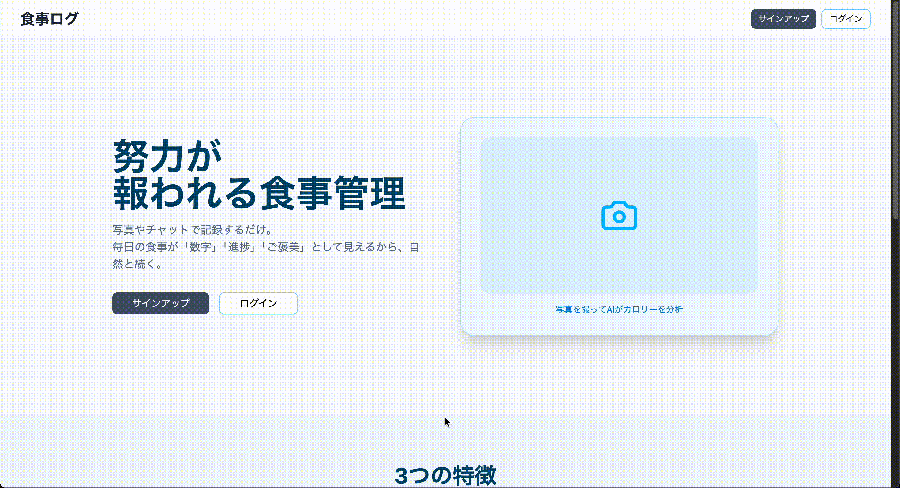
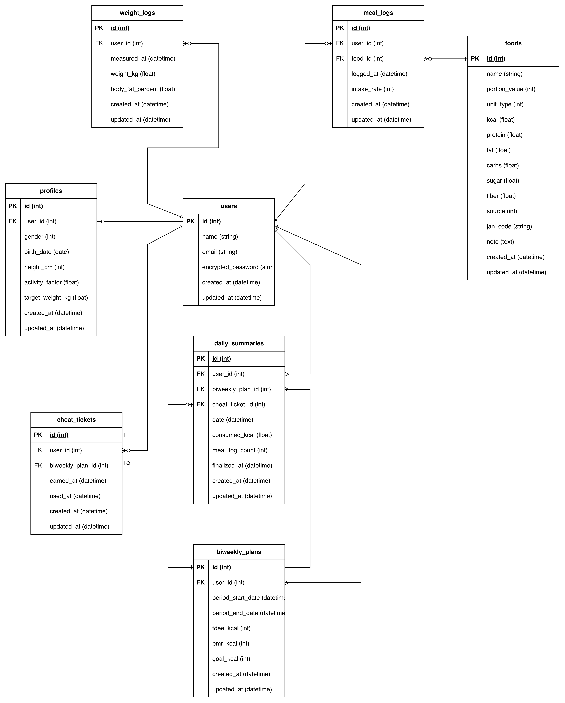

# 食事ログ

サービス URL：https://nutrition-log-app.onrender.com

# 概要

食事ログは、減量中の社会人が継続しやすいカロリー管理を目的とした Web アプリです。
食事・体重の記録により摂取カロリーを可視化し、一定期間の達成を前提にチートデイを組み込んだ設計を採用しています。
継続を重視し、減量行動を続けやすくすることを目指しています。

# サービス開発の背景

私は既存の栄養管理アプリを使って食事の記録を行っていましたが、
食事の記録を続けているうちに、次第に作業のように感じるようになり、モチベーションが続かなくなりました。
チートデイも自己判断で設けていたため管理が曖昧になり、記録を途中でやめてしまうことがありました。

この体験から、減量が続かない原因は意思の弱さではなく、
「毎日正しく管理できること」を前提とした仕組み自体に原因があると思いました。
多くのアプリでは 1 日の目標値は提示されるものの、
行動を継続すること自体が評価されにくく、最終的に自己管理に頼る形になります。

そこで本アプリでは、一定期間の継続を前提にチートデイを設ける仕組みを取り入れ、
減量行動を続けること自体が報われる体験を提供することを目指しました。

# ユーザ層

仕事をしながら減量をしている社会人を想定しています。
食事管理が大事なのは分かっているものの、毎日きっちりやるのは難しく、
「今日はどこまでなら大丈夫か」が分からなくなって挫折してしまう人向けです。

数字で目安を示しつつ、ある程度の自由を持たせることで、
無理なく減量を続けられるように設計しています。

# 機能一覧

# 使用技術

| カテゴリ       | 技術                    |
| -------------- | ----------------------- |
| バックエンド   | Ruby on Rails           |
| フロントエンド | Inertia.js（React）     |
| デザイン       | shadcn/ui, Tailwind CSS |
| 認証           | Devise                  |
| データベース   | PostgreSQL              |
| ストレージ     | Amazon S3               |
| CI / CD        | GitHub Actions          |
| インフラ       | Render                  |
| 開発環境       | Docker                  |

## 技術選定の理由

- **Ruby on Rails × Inertia.js（React）**

  - 現時点では大規模サービスを想定しておらず、開発効率を重視してモノリシック構成を採用
  - 将来的に本格開発を行う場合、フロントエンド（React）とバックエンド（Rails）を分離できる余地を残したかった
  - 初期はシンプルに、必要に応じて分離可能な構成として Inertia.js を選定

- **Tailwind CSS**

  - 実装スピードが速く、スタイル調整をコンポーネント単位で行いやすい
  - 拡張性・保守性が高く、Inertia.js（React）との相性が良い
  - デザインを大きく崩さず、素早く見た目を整えられる点を評価

- **shadcn/ui**

  - Card や Modal などの基本的な UI コンポーネントが揃っている
  - デザインの一貫性を保ちながら開発を進められる
  - コンポーネントのコードを直接調整でき、柔軟にカスタマイズ可能

- **Devise**

  - Rails で実績があり、最小限の工数で安定した認証機能を実装できる
  - Inertia.js と問題なく共存できる点を評価

- **PostgreSQL**
  - Rails との相性が良く、本番環境での安定性が高い
  - 検索機能や将来的な拡張にも対応しやすい

# ER 図

# 今後の展望

減量を継続できる体験を最優先に設計しています。
そのため、まずは食事管理の土台となる食品登録・食事記録機能を実装しました。

現在は、体重管理やチートデイを含む目標管理ロジックの実装を進めており、
行動の継続が自然に評価される仕組みの構築を目指しています。

今後は以下の機能を段階的に追加する予定です。

- 体重の記録・推移管理
- 目標摂取カロリーと連動したチートデイの設定
- 一定期間の継続を評価するロジックの実装
